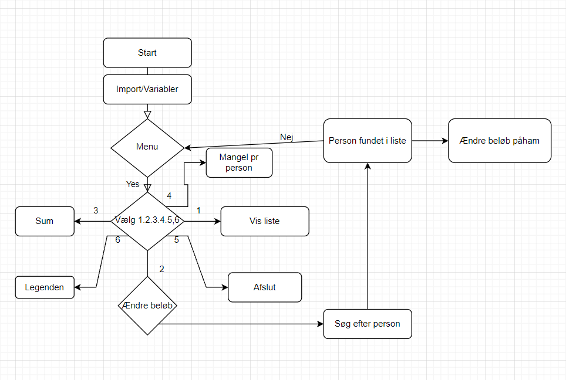
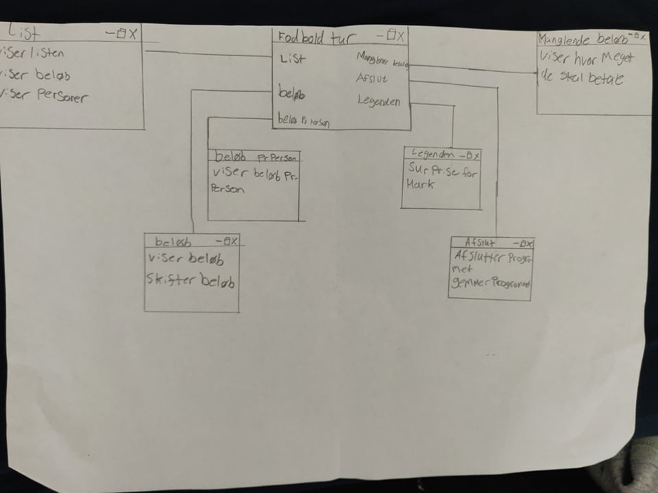
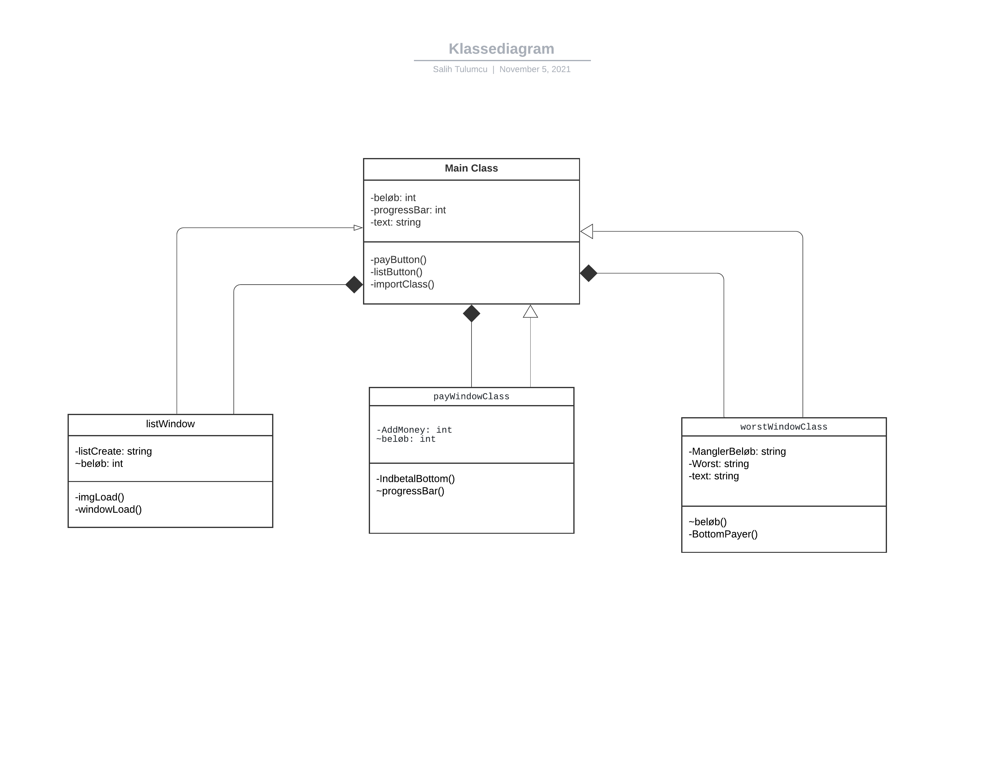

# FodboldturV2
Her er vores [Trello](https://trello.com/b/4R1T6xsX/fodboldturgui)

Dette er vores GitHub hvor vi så kan vise omkring hvad vi har lavet gennem dette forløb.

Første [Flowchart](flowchartbenson.PNG). I vores flowchart viser vi hvordan vi har delt det hele op fra punkt til punkt. 
Vi har skrevet op hvilken punkter går til hvad og hvornår den skal gå tilbage til menuen siden det er en forkert funktion.
 

Vi har lavet en GUI for at forsætte og lave nye ting til vores kode.
Vi har addeed flere ting ind til den for at have extra ting
plus for at have noget mere at vise i koden. I forhold til nu så har vi 6 ting at vælge imellem, men vi har tænkt os at
adde flere senere hen. [GUI](GUI.jpg)

Vi har lavet en Klassediagram for [FodboldGUI](https://github.com/Robotto/fodboldGUI) hvor som der kan ses hvordan denne UML Diagram er lavet
[Klasse Diagram](Klassediagram.png). 

I denne program som vi har lavet, skulle den kunne vise om hvilke personer har betalt deres pris og hvem der mangler at betale.
Det er en meget efficient måde at se hvem der mangler betalinger, for det hele skal nemlig gå til en fodboldtur. Den virker ret simpelt hvor man skriver ind betalinger til hvert person, der efter gemmer den beløbet.
Den kan også vise hvem der ikke har betalt nok, som er vores bund 3.

